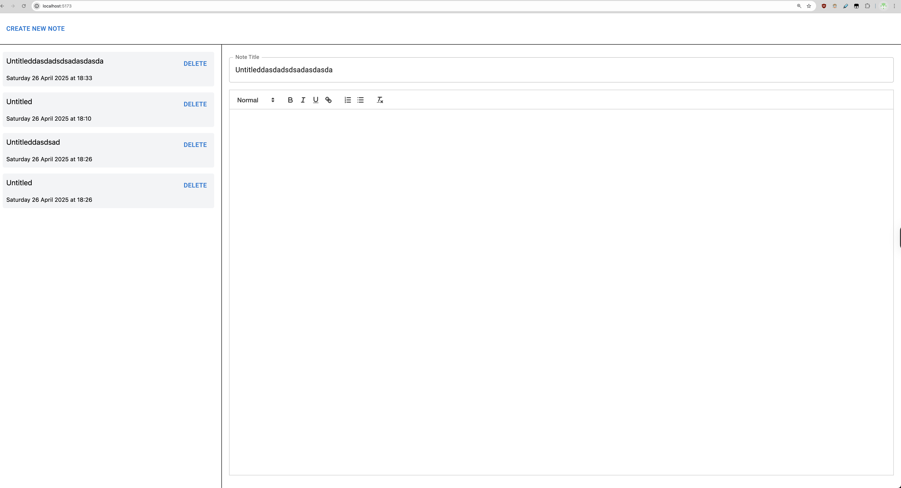

# Run the app
- `npm install` to install dependencies
- `npm run dev` to start the app

# Optimization choises:
- Memo callback, state using useCallback, useMemo
- Throttle a resize event on component notelist
- Debounce state propagate using debounce
- Virtualize note list
